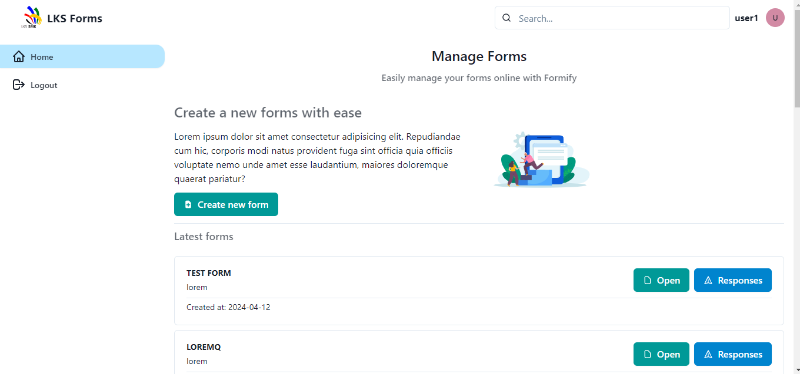

# **Formify**

Formify is a web app that's capable for users to create form dynamically according to the question types such as short answer, paragraph, date input, multiple choice, dropdown and checkboxes. Users who created the form can share the form link to the user to submit a response of the form and also see all of the responses.

## Application Setup

First of all, run the api services, [forms-api](https://github.com/Andikss/forms-api)

Then, open the *.env* file and enter your API Base URL

```bash
VITE_API_BASE_URL="https://forms-api.test/api/v1"
```

Run the application
```bash
npm run dev
```

Well, that's it! You can manage your forms now 😏

## Framework & Library

- ReactJS
- React Router
- React Icon
- Chakra UI

## Developer

- [Andika Dwi Saputra](https://andikss.github.io)
